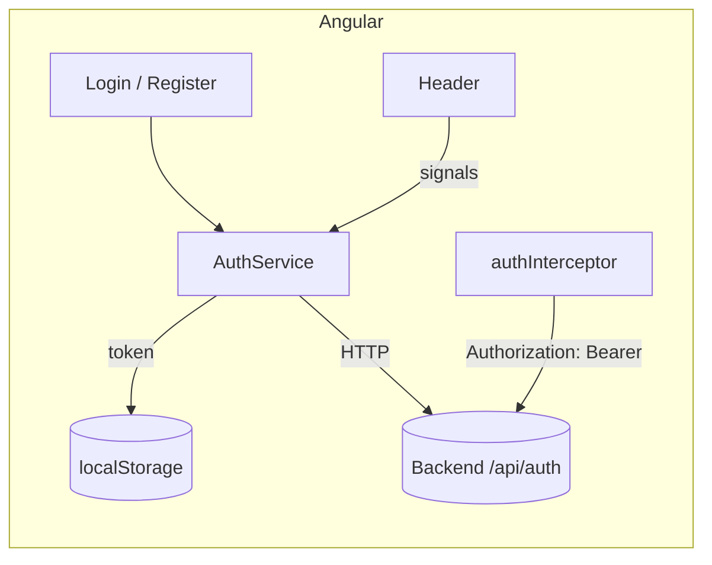

# Atelier — Authentification JWT côté Angular (projet `zappel`)

Cet atelier explique **pas à pas** comment le front Angular `zappel` a été
équipé de l'authentification par **token JWT**, en s'appuyant sur les routes
`/api/auth/*` du backend Express (`register`, `login`, `check-username`, `me`).

À la fin, vous saurez :
- stocker et réutiliser un token JWT ;
- ajouter automatiquement le token sur chaque requête via un **intercepteur** ;
- protéger un formulaire d'inscription avec un **validateur asynchrone** ;
- afficher un bouton connexion / déconnexion réactif dans le header.

> Prérequis : le backend doit tourner sur `http://localhost:3003`
> (compte de test par défaut : `admin` / `admin123`).

---

## Vue d'ensemble



Tous les fichiers d'authentification sont regroupés dans le dossier
`src/app/users/`.

| Fichier | Rôle |
|---|---|
| `users/auth.model.ts` | Interfaces TypeScript (DTO + réponses). |
| `users/auth-service.ts` | Appels HTTP + état de connexion (signals) + localStorage. |
| `users/auth-interceptor.ts` | Ajoute l'en-tête `Authorization` à chaque requête. |
| `users/username-validator.ts` | Validateur asynchrone « nom déjà pris ? ». |
| `users/login/` | Composant + formulaire de connexion. |
| `users/register/` | Composant + formulaire d'inscription. |

Fichiers modifiés : `app.config.ts`, `app.routes.ts`, `layout/header/*`.

---

## Étape 1 — Activer HttpClient + l'intercepteur

Le projet n'activait pas encore `HttpClient`. On l'ajoute dans
`src/app/app.config.ts`, en branchant au passage l'intercepteur JWT :

```ts
import { provideHttpClient, withInterceptors } from '@angular/common/http';
import { authInterceptor } from './users/auth-interceptor';

export const appConfig: ApplicationConfig = {
  providers: [
    provideBrowserGlobalErrorListeners(),
    provideRouter(routes),
    provideHttpClient(withInterceptors([authInterceptor])),
  ],
};
```

- `provideHttpClient` : rend `HttpClient` injectable partout.
- `withInterceptors([...])` : enregistre un ou plusieurs intercepteurs
  **fonctionnels** (la forme moderne, sans classe).

---

## Étape 2 — Les modèles (`auth.model.ts`)

On type les échanges avec le backend. Exemple :

```ts
export interface ILoginResponse {
  success: boolean;
  token: string;      // le JWT à conserver
  user: IAuthUser;    // { id, username, role }
}
```

Typer les réponses permet à TypeScript de nous aider (autocomplétion, erreurs).

---

## Étape 3 — Le service d'authentification (`auth-service.ts`)

C'est la pièce centrale. Il fait 3 choses :

### a) Appeler le backend

```ts
login$(dto: ILoginDto): Observable<ILoginResponse> {
  return this._http.post<ILoginResponse>(`${this._apiUrl}/login`, dto).pipe(
    tap((res) => this._persistSession(res.token, res.user)),
  );
}
```

`tap` est un **effet de bord** : on enregistre la session sans modifier la
valeur qui continue de circuler dans l'Observable.

### b) Conserver le token

Le token et l'utilisateur sont stockés dans le `localStorage` pour survivre à un
rechargement de page :

```ts
private _persistSession(token: string, user: IAuthUser): void {
  localStorage.setItem(this._tokenKey, token);
  localStorage.setItem(this._userKey, JSON.stringify(user));
  this._token.set(token);
  this._currentUser.set(user);
}
```

### c) Exposer l'état via des signals

```ts
private _token = signal<string | null>(this._readToken());
readonly currentUser = this._currentUser.asReadonly();
readonly isLoggedIn = computed(() => this._token() !== null);
```

- `signal` : valeur réactive.
- `computed` : valeur dérivée recalculée automatiquement.
- `asReadonly` : les composants peuvent lire mais pas modifier l'état.

> ⚠️ **Sécurité** : `localStorage` est simple mais vulnérable aux attaques XSS.
> Pour un vrai projet, envisagez un cookie `HttpOnly`. Ici, on privilégie la
> pédagogie.

---

## Étape 4 — L'intercepteur JWT (`auth-interceptor.ts`)

Il s'exécute pour **chaque** requête sortante et ajoute le token :

```ts
export const authInterceptor: HttpInterceptorFn = (req, next) => {
  const token = inject(AuthService).getToken();
  if (!token) return next(req);

  // Les requêtes sont IMMUABLES : on clone pour ajouter l'en-tête.
  const authReq = req.clone({
    setHeaders: { Authorization: `Bearer ${token}` },
  });
  return next(authReq);
};
```

Grâce à lui, aucune requête n'a besoin d'ajouter le token « à la main ».

---

## Étape 5 — Le validateur asynchrone (`username-validator.ts`)

Il interroge le backend pendant la saisie pour savoir si le nom est libre :

```ts
export function usernameTakenValidator(authService: AuthService): AsyncValidatorFn {
  return (control) => of(control.value?.trim()).pipe(
    debounceTime(400),                    // on attend une pause de frappe
    switchMap((username) =>
      authService.checkUsername$(username).pipe(
        map((res) => (res.taken ? { usernameTaken: true } : null)),
        catchError(() => of(null)),       // pas de blocage si le réseau échoue
      ),
    ),
    first(),                              // requis : l'Observable doit se terminer
  );
}
```

Notions clés :
- **validateur asynchrone** : renvoie un `Observable<ValidationErrors | null>`.
- `debounceTime` : évite un appel réseau à chaque touche.
- `switchMap` : annule l'appel précédent si une nouvelle valeur arrive.
- `first()` : termine l'Observable (obligatoire pour un validateur async).

---

## Étape 6 — Les composants Login et Register

### Login (`users/login/`)

Formulaire réactif à deux champs. À la soumission :

```ts
this._authService.login$({ username, password }).subscribe({
  next: () => this._router.navigate(['/appel/dashboard']),
  error: (err) => this.errorMessage.set(err.error?.message ?? 'Connexion impossible.'),
});
```

### Register (`users/register/`)

Le champ `username` combine validateurs synchrones et asynchrone :

```ts
username: new FormControl('', {
  validators: [Validators.required, Validators.minLength(3)],
  asyncValidators: [usernameTakenValidator(this._authService)],
  updateOn: 'blur', // valide quand on quitte le champ (moins d'appels réseau)
}),
```

Dans le template, on affiche l'état du champ :

```html
@if (form.controls.username.pending) { <mat-hint>Vérification…</mat-hint> }
@if (form.controls.username.hasError('usernameTaken')) {
  <mat-error>Ce nom d'utilisateur est déjà pris.</mat-error>
}
```

---

## Étape 7 — Les routes (`app.routes.ts`)

```ts
{ path: 'login', component: Login },
{ path: 'register', component: Register },
```

---

## Étape 8 — Le bouton d'authentification dans le header

Le header injecte `AuthService` et lit ses signals :

```ts
readonly isLoggedIn = this._authService.isLoggedIn;
readonly currentUser = this._authService.currentUser;

logout(): void {
  this._authService.logout();
  this._router.navigate(['login']);
}
```

Template (mise à jour automatique grâce aux signals) :

```html
@if (isLoggedIn()) {
  <span>👤 {{ currentUser()?.username }}</span>
  <button mat-stroked-button (click)="logout()">Se déconnecter</button>
} @else {
  <a mat-stroked-button routerLink="/login">Connexion</a>
  <a mat-flat-button color="primary" routerLink="/register">Inscription</a>
}
```

---

## Étape 9 — Protéger des routes avec un guard

Un **guard** `CanActivateFn` s'exécute avant d'activer une route. Fichier
`users/auth-guard.ts` :

```ts
export const authGuard: CanActivateFn = (route, state) => {
  const authService = inject(AuthService);
  const router = inject(Router);

  if (authService.isLoggedIn()) {
    return true; // accès autorisé
  }
  // Sinon redirection vers /login en mémorisant l'URL demandée.
  return router.createUrlTree(['/login'], {
    queryParams: { redirectTo: state.url },
  });
};
```

On l'applique aux routes à protéger dans `app.routes.ts` :

```ts
{ path: 'appel/dashboard', component: AppelsDashboard, canActivate: [authGuard] },
{ path: 'appel/ajout', component: AppelAddForm, canActivate: [authGuard] },
```

Après connexion, le composant `Login` relit le paramètre `redirectTo` pour
renvoyer l'utilisateur là où il voulait aller :

```ts
const redirectTo = this._route.snapshot.queryParamMap.get('redirectTo');
this._router.navigateByUrl(redirectTo ?? '/appel/dashboard');
```

---

## Étape 10 — Tester

1. Démarrer le backend (`npm run dev` dans `backExpress`).
2. Démarrer le front : `ng serve`.
3. Cliquer sur **Inscription** → créer un compte (essayez `admin` pour voir
   l'erreur « déjà pris » venant du validateur asynchrone).
4. Se **connecter** → le header affiche le nom d'utilisateur.
5. Ouvrir les DevTools (onglet Réseau) : les requêtes portent l'en-tête
   `Authorization: Bearer …` ajouté par l'intercepteur.
6. Se **déconnecter** → le token est effacé, les boutons réapparaissent.

---

## Pour aller plus loin

- **Expiration** : intercepter les réponses `401` pour déconnecter
  automatiquement quand le token expire.
- **Refresh token** : pour prolonger la session sans redemander le mot de passe.
- **Sécurité du stockage** : préférer un cookie `HttpOnly` à `localStorage`.
- **Guard par rôle** : étendre `authGuard` pour vérifier `currentUser()?.role`.

---

## Récapitulatif des fichiers

**Créés**
- `src/app/users/auth.model.ts`
- `src/app/users/auth-service.ts`
- `src/app/users/auth-interceptor.ts`
- `src/app/users/username-validator.ts`
- `src/app/users/auth-guard.ts`
- `src/app/users/login/login.ts` (+ `.html`, `.scss`)
- `src/app/users/register/register.ts` (+ `.html`, `.scss`)

**Modifiés**
- `src/app/app.config.ts` (HttpClient + intercepteur)
- `src/app/app.routes.ts` (routes login / register + guard sur les routes appels)
- `src/app/layout/header/header.ts` / `.html` / `.scss` (bouton auth)
